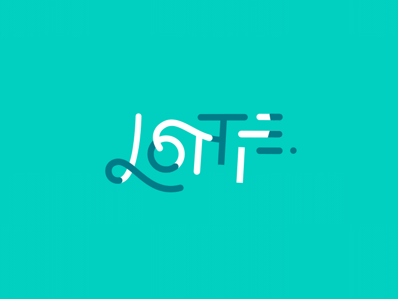

# Explainer for Native Lottie support

This proposal is an early design sketch by the Skia team to describe the problem below and solicit
feedback on the proposed solution. It has not been approved to ship in Chrome.

## Participate
- [Discussion forum](https://github.com/explainers-by-googlers/native-lottie-support/issues)

## Introduction

<br>

[Lottie](https://lottiefiles.com/what-is-lottie) is a popular vector animation format used for motion graphics in both native and web applications, and developed as an open specification under the Joint Development Foundation
and the [Lottie Animation Community](https://lottie.github.io/) working group.  The format is largely based on the Adobe AfterEffects animation model, and various tools exist for exporting AE animations to Lottie. Lottie is also supported by several other [design tools](https://lottiefiles.com/integrations).

Current web deployment solutions rely on external players and present challenges due to necessary compromises on performance, feature support, and application download size. This proposal aims to bring first-class Lottie support to the web platform by exposing native Lottie functionality in the browser, in the form of a video codec. This allows taking advantage of existing mature video decoding infrastructure, offering an accelerated decoding path and acceptable playback control via existing video APIs.

## Goals

First-class Lottie support on the web platform:

- **Feature parity** with state-of-the-art native engines, without a download size penalty.
- **Uncompromising animation performance** - Lottie animations should be regarded as lightweight assets, with minimal impact on web app performance.

## Non-goals

- **Expose Lottie-specific APIs** such as theming, asset substitution, etc.

## Use cases

### High-performance, rich, vector graphics animations

Developers are looking to include complex vector graphics animations such as hero illustrations or
interactive UI elements, without the overhead of large support libraries.  For an optimal user experience,
these animations assets should:

1) minimize the page load impact
2) minimize the rendering overhead and general performance impact
3) offer a rich feature set to support delightful motion design expressions

## Potential Solution: Native Lottie as a video codec

In order to address all three axes (performance, features, download size), we propose exposing native
Lottie support in the browser as a new video codec.

```html
<video autoplay loop muted playsinline>
  <source src="animations/hero-illustration.lot" type="video/lottie+json">
</video>
```

The video source approach takes advantage of existing mature video decoding infrastructure, thus minimizing any new API-related concerns. It also offers an accelerated decoding path for maximizing performance, and acceptable playback/timeline control functionality via existing video APIs.

### How this solution would solve the use cases

#### High-performance, rich, vector graphics animations

By integrating Lottie support directly into the browser's video stack, animations can be decoded and rendered with high efficiency, similar to traditional video formats, but retaining the vector nature and small file size of Lottie JSON. This eliminates the need for large external libraries and provides better performance than JS-driven rendering.

Integrated support also allows implementors to target the full Lottie feature set, unconstrained by
existing web graphics APIs.

## Detailed design discussion

### Lack of Lottie-specific APIs

A potential downside is the lack of Lottie-specific APIs - e.g. the ability to customize animation slots (theming), or interactivity (more of a future concern as interactive functionality is not part of the spec at this time).

An altenative design which would address these limitations involves the introduction of a new /<lottie/> element and related JS APIs.  While more comprehensive in terms of Lottie capabilities, such an approach would require a large spec surface, and likely face standardization challenges.

## Alternatives considered

### Existing web animation APIs (SVG/SMIL, WAAPI)

One of the main selling points for Lottie and the major driver behind its popularity is the authoring story:
motion designers use flagship authoring tools such as Adobe AfterEffects to generate animation assets with minimal
friction.  Other animation formats fall short in terms of designer affinity and feature set.

### Existing Lottie rendering engines

#### LottieWeb

LottieWeb is a JS Lottie engine that can render either to a Canvas 2d or to SVG/DOM.

The Canvas 2d backend has better performance but limited feature support, while the SVG backend supports some additional features while lagging in performance (DOM-level animation).

Both backends are limited feature wise compared to the general Lottie feature set, due to web platform
graphics APIs constraints (Canvas 2d, SVG).

The library size is in the 250-600KB range, depending on build configuration.

#### WASM engines
There are several native Lottie engines available (notably Skia’s Skottie, and LottieFiles’ dotLottie engine) that can be used in web apps via WASM.  They back onto WebGL/WebGPU, so performance is generally good - as is the supported feature set.

The main downside is the download size: since these engines must include full rendering stacks (e.g. Skia + third-party deps in the case of Skottie), the binary size is an order of magnitude higher than LottieWeb (SkottieWASM: 3.2MB compressed), making them poorly suited for anything other than specialized apps.

## Security and Privacy Considerations

[TODO Describe any interesting answers you give to the [Security and Privacy Self-Review
Questionnaire](https://www.w3.org/TR/security-privacy-questionnaire/) and any interesting ways that
your feature interacts with [Chromium's Web Platform Security
Guidelines](https://chromium.googlesource.com/chromium/src/+/master/docs/security/web-platform-security-guidelines.md).]

